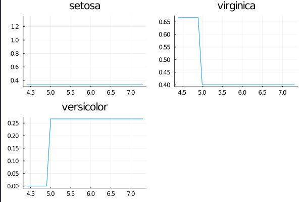
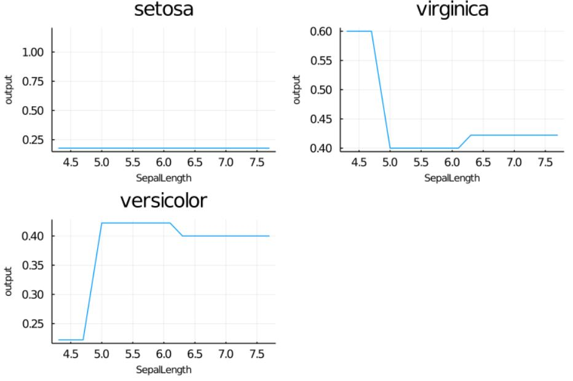

# SIMPLE PDP IMPLEMENTATION
The partial dependence plot (short PDP or PD plot) shows the marginal effect one or two features have on the predicted outcome of a machine learning model. A partial dependence plot can show whether the relationship between the target and a feature is linear, monotonic or more complex. For example, when applied to a linear regression model, partial dependence plots always show a linear relationship.

## Intro:
In this repo we use a PDP graph for a multiclass classification problem to understand how the variation of a single parameter (sepal length) Ceteris paribus affects the output (predicted Species) of a DecisionTreeClassifier trained on the iris dataset.

## PDP Samples:

| legend ||
| ----------- | ----------- |
|X_Axis| Sepal Length|
|Y_Axis| Mean probability of classification (type is the title of the subplots)|

#### Training 1:

#### Training 2:

These plots show the isolated effect of just the Sepal Length on the classification done by the model. 

### Sources
[PDP tutorial](https://christophm.github.io/interpretable-ml-book/pdp.html)  
[Model Used](https://alan-turing-institute.github.io/MLJ.jl/dev/getting_started/)
