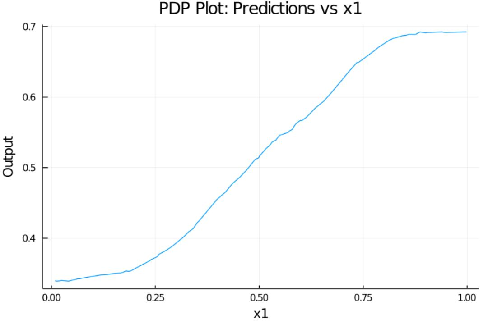
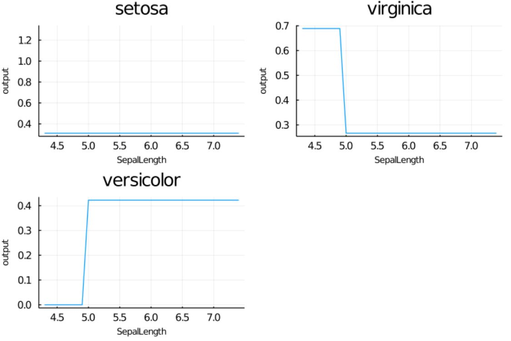

# SIMPLE PDP IMPLEMENTATION
The partial dependence plot (short PDP or PD plot) shows the marginal effect one or two features have on the predicted outcome of a machine learning model. A partial dependence plot can show whether the relationship between the target and a feature is linear, monotonic or more complex. For example, when applied to a linear regression model, partial dependence plots always show a linear relationship.

## Intro:
In this repo we use a PDP graph used to gauge how the variation of a single parameter Ceteris paribus affects the output of a ML Model.

## PDP Sample 1:
Here we use a synthetic data and a KNN model trained on that data and see how the variation of one parameter ("x1") varies the prediction of the model. 
[Model Used, along with the synthetic data and RNG seed](https://alan-turing-institute.github.io/DataScienceTutorials.jl/getting-started/ensembles/)

| legend ||
| ----------- | ----------- |
|X_Axis| x1|
|Y_Axis| The prediction of the KNNRegressor|

#### Output Plot:

## PDP Sample 2:
Here we use the iris dataset to train a simple DecisionTreeClassifier and see how the variation of one parameter (Sepal Length) Changes the output ( species prediction ).  
[Model Used](https://alan-turing-institute.github.io/MLJ.jl/dev/getting_started/)

| legend ||
| ----------- | ----------- |
|X_Axis| Sepal Length|
|Y_Axis| Mean probability of classification (type is the title of the subplots)|

#### Training 1:

#### Training 2:

These plots show the isolated effect of just the Sepal Length on the classification done by the model. 

### Sources
[PDP tutorial](https://christophm.github.io/interpretable-ml-book/pdp.html)  
[Model Used, along with the synthetic data and RNG seed for Sample 1](https://alan-turing-institute.github.io/DataScienceTutorials.jl/getting-started/ensembles/)  
[Model Used for Sample 2](https://alan-turing-institute.github.io/MLJ.jl/dev/getting_started/)
